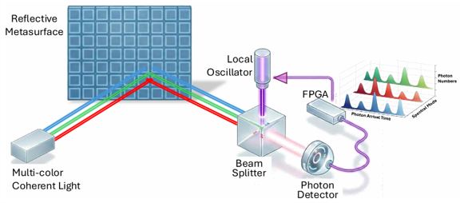

# Quantum-Enhanced Information Retrieval from Reflective Intelligent Surfaces

This repository contains the simulation code accompanying the paper:

> **Quantum-enhanced Information Retrieval from Reflective Intelligent Surfaces**  
> Shiqian Guo, Tingxiang Ji, Jianqing Liu  
> Department of Computer Science, North Carolina State University

---

## 🔬 Overview

Passive backscatter systems (e.g., RFID-like devices) are energy efficient but suffer from a fundamental **rate–range limitation** due to weak reflected signals and classical receiver sensitivity constraints.

This work presents a **quantum sensing–enabled reader** for information retrieval from a **reflective intelligent surface (RIS)** that supports **large-alphabet modulation**. The design uses:

- **Multi-mode probing coherent light** (multi-color / multi-wavelength, optional)
- An **adaptive time-resolving quantum receiver**
- **Bayesian posterior updates** driven by photon arrival-time statistics

Importantly, the proposed quantum advantage is achieved **without fragile quantum resources** such as entanglement.

---

## 📊 Framework

<p align="center">
  
</p>

<p align="center">
  <em>RIS-modulated information retrieval system with an adaptive time-resolving quantum receiver</em>
</p>

1. A coherent probing signal illuminates the RIS (optionally using multiple spectral modes).
2. The RIS encodes information by **joint amplitude and phase modulation**, producing an M-ary coherent-state constellation.
3. The receiver applies an **adaptive displacement** (via a local oscillator) followed by **single-photon detection**.
4. Photon arrival times are used to compute likelihoods and update a Bayesian posterior.
5. The receiver chooses the next LO displacement based on the current MAP hypothesis and repeats until the symbol duration is exhausted.

---

## 📈 Performance Comparison (placeholders)

<p align="center">
  
  
  
</p>

<p align="center">
  <b>Left:</b> M = 2^4 (16-ary) &nbsp;&nbsp;
  <b>Middle:</b> M = 2^6 (64-ary) &nbsp;&nbsp;
  <b>Right:</b> M = 2^8 (256-ary)
</p>

Simulation results demonstrate that the proposed **RIS–QR** receiver can **surpass the classical standard quantum limit (SQL)** for modulation sizes up to **M = 2^8**, and can reduce the probing energy (or extend distance) compared with optimal classical baselines.

---

## 🧠 Key Innovations

- **Large-alphabet RIS modulation** using joint amplitude + phase control, enabling high-capacity encoding.
- **Adaptive time-resolving quantum receiver** using photon arrival-time statistics rather than fixed-time photon counts.
- **Bayesian adaptive displacement strategy**: the LO displacement is updated online based on posterior beliefs.
- **Quantum advantage without entanglement**: uses coherent probing light + adaptive receiver architecture.

---

## ⚙️ Experiment Settings

The simulation code uses the following default settings and conventions:

### Randomness / numerical constants
- Random generator: `numpy.random.default_rng(12345)` (fixed seed by default)
- Small constant: `eps = 1e-300` (used for numerical stability)

### Bit setting → modulation alphabet size
- `bit4`  → M = 2^4  = 16
- `bit6`  → M = 2^6  = 64
- `bit8`  → M = 2^8  = 256

### Spectral modes S (multi-mode probing)
Each folder provides scripts for different numbers of modes:
- S ∈ {1, 2, 3, 7}

The code uses the following default per-mode detection efficiencies (area efficiencies):
- S=1: `[0.99]`
- S=2: `[0.99, 0.69]`
- S=3: `[0.99, 0.69, 0.69]`
- S=7: `[0.99, 0.69, 0.69, 0.69, 0.69, 0.69, 0.69]`

A normalization factor is applied:
- `n0 = 1 / S`
- the symbol amplitudes are scaled by `sqrt(n0)` to account for splitting across S modes.

### Receiver visibility / interference quality (rr)
Default visibility depends on modulation size:
- bit4: rr = 0.997
- bit6: rr = 0.998
- bit8: rr = 0.9995

(If your script exposes an “ideal” option, it corresponds to rr = 1.0.)

### Time budget and feedback delay
The simulation uses a total symbol time budget `T_full` (set per bit setting) and a per-step feedback delay:

- bit4: `T_full = 13`
- bit6: `T_full = 23`
- bit8: `T_full = 30`

Additional timing rules inside the adaptive receiver loop:
- Maximum time-bin per update: `tau_bin_max = T_full / 10`
- Feedback delay per update: `feedback_delay = 1`
- A practical safety cap is used to avoid extremely long loops (max ~200 updates).

### Number of RIS configurations / “RIS-num” (n)
The default number of RIS elements/configurations used in simulation is:
- bit4: `n = 1000`
- bit6: `n = 2000`
- bit8: `n = 4000`

The script prints: `Running simulation for RIS-num = n`.

### Energy / constellation construction parameters
RIS constellations are built using nonuniform phase modulation (NPM) rings:

**bit4 (16-RIS; 2 rings)**
- Inner ring: 4 points
- Outer ring: 12 points
- Default energy parameters (scaled by `n`):  
  - `NI = 20.0 * n`  
  - `NO = 80.0 * n`

**bit6 (64-RIS; 4 rings)**
- Rings = 4
- Points per ring: 4(2i−1), i = 1..4
- Ring energies linearly spaced (scaled by `n`):
  - `NI_list = linspace(NI_min * n, NI_max * n, rings)`
  - Defaults: `NI_min = 10.0`, `NI_max = 80.0`, `rings = 4`

**bit8 (256-RIS; 8 rings)**
- Rings = 8
- Points per ring: 4(2i−1), i = 1..8
- Ring energies linearly spaced (scaled by `n`):
  - `NI_list = linspace(NI_min * n, NI_max * n, rings)`
  - Defaults: `NI_min = 10.0`, `NI_max = 160.0`, `rings = 8`

---

## ▶️ Running the Code

Choose the folder for your modulation size and run the script for the desired number of spectral modes S.

### Example 1: bit6, S=1
```
python RS-QR-bit6/RIS-mS1-bit6.py
```

### Example 2: bit4, S=3
```
python RS-QR-bit4/RIS-mS3-bit4.py
```

If the filenames include suffixes (e.g., `...-eig.py`), use the exact uploaded filename.

### Run SQL baseline simulations

To reproduce the classical shot-noise-limit benchmarks used in the paper (can also change bit4/bit6/bit8):
```
python SQL-mixReceiver/SQL-mixReceiver-bit4.py
```

---

## 📖 Citation

Cite the paper as:

```
@article{guo2025quantum,
  title={Quantum-enhanced Information Retrieval from Reflective Intelligent Surfaces},
  author={Guo, Shiqian and Ji, Tingxiang and Liu, Jianqing},
  journal={arXiv preprint arXiv:2512.17199},
  year={2025}
}
```

---

## 📬 Contact

For collaboration inquiries:

📧 sguo26@ncsu.edu  
📧 tji2@ncsu.edu  
📧 jliu96@ncsu.edu
